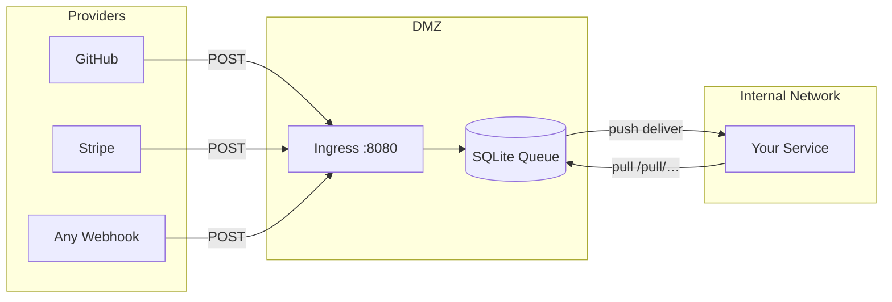

# Hookaido

[](https://github.com/nuetzliches/hookaido/actions/workflows/ci.yml)
[](https://github.com/nuetzliches/hookaido/actions/workflows/release.yml)
[](go.mod)
[](LICENSE)
[](https://github.com/nuetzliches/hookaido/releases)

Docs: https://nuetzliches.github.io/hookaido/

**Webhook infrastructure that just works.** Single binary. Zero runtime dependencies. Production-ready defaults.

Hookaido receives webhooks at the edge, queues them durably, and delivers them to your services — with retries, dead-letter queues, and cryptographic verification built in. Think of it as Caddy for webhooks: a compact config file, sensible defaults, and instant reloads.

---

## Why Hookaido?

| Problem                                                     | Hookaido                                                                     |
| ----------------------------------------------------------- | ---------------------------------------------------------------------------- |
| Webhooks hit your app directly — downtime means lost events | Durable SQLite/WAL queue absorbs traffic; your services consume when ready   |
| Retry logic scattered across services                       | Exponential backoff, jitter, DLQ, and lease-based delivery — configured once |
| DMZ security headaches                                      | Pull mode by default: internal services fetch from the DMZ, no inbound holes |
| Complex multi-service deployment                            | Single binary, one config file, `go build` and run                           |
| Webhook signature verification is error-prone               | Built-in HMAC-SHA256 verification with replay protection and secret rotation |

## Key Features

- **Durable queue** — SQLite/WAL persistence with at-least-once delivery. In-memory mode for development.
- **Pull & push modes** — Pull API for DMZ-safe consumption, push dispatcher with concurrency control.
- **Hot reload** — Change config, send `SIGHUP` or use `--watch`. No restarts for most changes.
- **Ingress security** — HMAC signature verification, Basic auth, forward auth callouts, rate limiting.
- **Outbound signing** — HMAC-SHA256 on push delivery with multi-secret rotation windows.
- **Dead-letter queue** — Failed messages land in the DLQ with full attempt history. Requeue or inspect via API.
- **Admin API** — Health checks, queue inspection, backlog trends, publish/cancel/requeue operations.
- **Observability** — Structured JSON logs, Prometheus metrics, OpenTelemetry tracing (OTLP).
- **AI-ready** — Built-in MCP server for AI tooling integration (config inspection, queue diagnostics, mutations).
- **Channel types** — `inbound` (edge webhooks), `outbound` (API→queue→push), `internal` (job queues).
- **VS Code extension** — Syntax highlighting and snippets for Hookaidofile (`editors/vscode/`).

## Quick Start

**Download a binary** from the [latest release](https://github.com/nuetzliches/hookaido/releases) — no Go required.

**Or build from source** (requires Go 1.25+):

```bash
go build ./cmd/hookaido
```

**Or use Docker:**

```bash
docker build -t hookaido .
docker run -p 8080:8080 -p 9443:9443 \
  -e HOOKAIDO_PULL_TOKEN=mytoken \
  -v $(pwd)/Hookaidofile:/app/Hookaidofile:ro \
  -v hookaido-data:/app/.data \
  hookaido
```

**Run locally:**

```bash
export HOOKAIDO_PULL_TOKEN="mytoken"
./hookaido run --config Hookaidofile --db ./.data/hookaido.db
```

Ingress on `:8080`, Pull API on `:9443`, Admin on `127.0.0.1:2019` — ready to receive webhooks.

## Configuration

A Hookaidofile is all you need. Caddy-inspired syntax, designed for readability:

**Receive & pull (DMZ-safe):**

```hcl
ingress {
  listen :8080
}

pull_api {
  auth token env:HOOKAIDO_PULL_TOKEN
}

/webhooks/github {
  auth hmac env:HOOKAIDO_INGRESS_SECRET
  pull { path /pull/github }
}
```

**Receive & push (direct delivery):**

```hcl
/webhooks/stripe {
  auth hmac env:STRIPE_SIGNING_SECRET
  deliver "https://billing.internal/stripe" {
    retry exponential max 8 base 2s cap 2m jitter 0.2
    timeout 10s
  }
}
```

**Outbound queue (no ingress, API-published):**

```hcl
outbound /jobs/deploy {
  deliver "https://ci.internal/deploy" { timeout 10s }
}
```

**Internal job queue (pull-only, no ingress):**

```hcl
internal {
  /jobs/cleanup {
    pull { path /pull/cleanup }
  }
}
```

Placeholders keep secrets out of config: `{$VAR}`, `{env.VAR}`, `{file./run/secrets/key}`, `{vars.NAME}`.

Full DSL reference → [DESIGN.md](DESIGN.md)

## Architecture



**Default: `dmz-queue pull`** — Hookaido sits in the DMZ. Internal workers pull over HTTPS. No inbound firewall rules needed.

## Admin API

`GET /healthz?details=1` — queue diagnostics, backlog trends, operator action playbooks.

`POST /messages/publish` — inject messages programmatically.

`GET /dlq` / `POST /dlq/requeue` — inspect and recover dead-lettered messages.

`GET /backlog/trends` — time-series backlog analysis with derived signals.

Full endpoint list → [DESIGN.md](DESIGN.md)

## Observability

```hcl
observability {
  access_log  { output stderr; format json }
  runtime_log { level info; output stderr; format json }
  metrics     { listen ":9900"; prefix "/metrics" }
  tracing     { collector "https://otel.example.com/v1/traces" }
}
```

Prometheus counters for ingress accept/reject, delivery attempts/ack/retry/dead, and queue depth gauges. OpenTelemetry traces with full OTLP/HTTP configuration.

## MCP Server (AI Integration)

```bash
./hookaido mcp serve --config Hookaidofile --db ./.data/hookaido.db --role read
```

Exposes queue state, config inspection, health diagnostics, and backlog analysis as structured tools for AI assistants. Role-gated access: `read`, `operate`, `admin`.

## Release Verification

Releases ship with signed checksums (Ed25519), SPDX SBOM, and GitHub provenance attestations:

```bash
./hookaido verify-release --checksums hookaido_v1.0.0_checksums.txt \
  --public-key release-signing-key.pub \
  --require-provenance
```

## Requirements

- Pre-built binaries: no dependencies (download from [Releases](https://github.com/nuetzliches/hookaido/releases))
- Build from source: Go 1.25+
- Docker: see [Docker quickstart](docs/docker.md)
- No external runtime dependencies

## Documentation

| Document                         | Purpose                                                                      |
| -------------------------------- | ---------------------------------------------------------------------------- |
| [docs/](docs/index.md)           | User-facing documentation (getting started, configuration, APIs, deployment) |
| [docs/docker.md](docs/docker.md) | Docker / Docker Compose quickstart                                           |
| [DESIGN.md](DESIGN.md)           | Canonical DSL and API specification                                          |
| [CHANGELOG.md](CHANGELOG.md)     | User-visible changes                                                         |
| [STATUS.md](STATUS.md)           | Development progress snapshot                                                |
| [BACKLOG.md](BACKLOG.md)         | Prioritized work items                                                       |

## License

Apache-2.0 — see [LICENSE](LICENSE).
