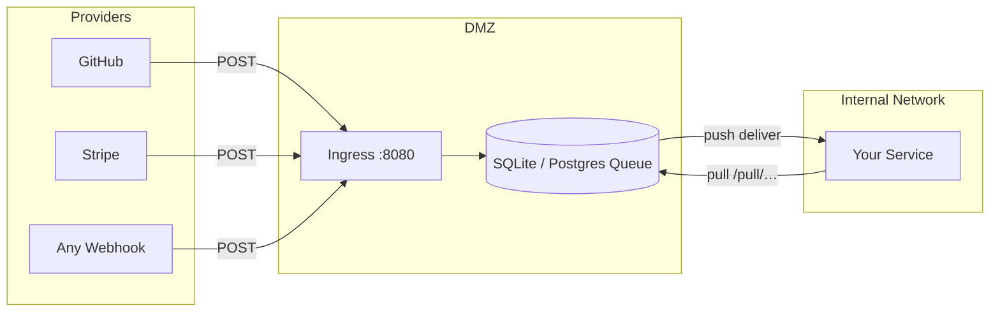

# Hookaido

[](https://github.com/nuetzliches/hookaido/actions/workflows/ci.yml)
[](https://github.com/nuetzliches/hookaido/actions/workflows/release.yml)
[](https://github.com/nuetzliches/hookaido/pkgs/container/hookaido)
[](LICENSE)
[](https://github.com/nuetzliches/hookaido/releases)

**Webhook infrastructure that just works.** Single binary. Zero runtime dependencies. Production-ready defaults.

Hookaido receives webhooks at the edge, queues them durably, and delivers them to your services — with retries, dead-letter queues, and cryptographic verification built in. Think of it as Caddy for webhooks: a compact config file, sensible defaults, and instant reloads.

Docs: https://nuetzliches.github.io/hookaido/

---

## Why Hookaido?

| Problem                                                     | Hookaido                                                                     |
| ----------------------------------------------------------- | ---------------------------------------------------------------------------- |
| Webhooks hit your app directly — downtime means lost events | Durable SQLite/WAL or PostgreSQL queue absorbs traffic; your services consume when ready   |
| Retry logic scattered across services                       | Exponential backoff, jitter, DLQ, and lease-based delivery — configured once |
| DMZ security headaches                                      | Pull mode by default: internal services fetch from the DMZ, no inbound holes |
| Complex multi-service deployment                            | Single binary, one config file, `go build` and run                           |
| Webhook signature verification is error-prone               | Built-in HMAC-SHA256 verification with replay protection and secret rotation |

## Who Is It For?

- **SaaS integrators** receiving webhooks from GitHub, Stripe, Shopify, or any HTTP callback provider
- **Platform engineers** building DMZ-safe webhook ingestion without opening inbound firewall rules
- **DevOps teams** triggering local deploy scripts, CI jobs, or automation from webhook events
- **Event-driven architectures** that need a durable queue as lightweight middleware between producers and consumers

## Key Features

### Core

- **Durable queue** — SQLite/WAL or PostgreSQL persistence with at-least-once delivery. In-memory mode for development.
- **Pull, push & exec** — Pull API for DMZ-safe consumption, push dispatcher with concurrency control, subprocess execution for local scripts.
- **Hot reload** — Change config, send `SIGHUP` or use `--watch`. No restarts for most changes.
- **Channel types** — `inbound` (edge webhooks), `outbound` (API-published queues), `internal` (job queues).

### Security

- **Ingress auth** — HMAC signature verification with replay protection, Basic auth, forward auth callouts, rate limiting. Provider-compatible mode for GitHub and Gitea/Forgejo webhooks.
- **Outbound signing** — HMAC-SHA256 on push delivery with multi-secret rotation windows and custom outbound headers.
- **Secret management** — Env vars, files, Vault refs, and raw literals. Placeholder interpolation keeps secrets out of config.

### Operations

- **Dead-letter queue** — Failed messages land in the DLQ with full attempt history. Requeue or inspect via API.
- **Admin API** — Health checks, queue inspection, backlog trends, publish/cancel/requeue operations.
- **Observability** — Structured JSON logs, Prometheus metrics, OpenTelemetry tracing (OTLP).
- **MCP server** — AI tooling integration with role-gated config inspection, queue diagnostics, and mutations.
- **VS Code extension** — Syntax highlighting and snippets for Hookaidofile (`editors/vscode/`).

## Quick Start

**Download a binary** from the [latest release](https://github.com/nuetzliches/hookaido/releases) — no Go required.

**Or build from source** (requires Go 1.25+):

```bash
go build ./cmd/hookaido
```

**Or use Docker (official GHCR image):**

```bash
docker pull ghcr.io/nuetzliches/hookaido:latest
docker run -p 8080:8080 -p 9443:9443 \
  -e HOOKAIDO_PULL_TOKEN=mytoken \
  -v $(pwd)/Hookaidofile:/app/Hookaidofile:ro \
  -v hookaido-data:/app/.data \
  ghcr.io/nuetzliches/hookaido:latest
```

For immutable deployments, pin to a release tag (for example `:v2.0.0`) or digest.

**Run locally:**

```bash
export HOOKAIDO_PULL_TOKEN="mytoken"
./hookaido run --config Hookaidofile --db ./.data/hookaido.db
```

Ingress on `:8080`, Pull API on `:9443`, Admin on `127.0.0.1:2019` — ready to receive webhooks.

## Configuration

A Hookaidofile is all you need. Caddy-inspired syntax, designed for readability:

**Receive & pull (DMZ-safe):**

```hcl
ingress {
  listen :8080
}

pull_api {
  auth token env:HOOKAIDO_PULL_TOKEN
}

/webhooks/github {
  auth hmac env:HOOKAIDO_INGRESS_SECRET
  pull { path /pull/github }
}
```

**Receive & push (direct delivery):**

```hcl
/webhooks/stripe {
  auth hmac env:STRIPE_SIGNING_SECRET
  deliver "https://billing.internal/stripe" {
    retry exponential max 8 base 2s cap 2m jitter 0.2
    timeout 10s
  }
}
```

**Deliver via subprocess (no HTTP server needed):**

```hcl
/webhooks/github {
  auth hmac { provider github; secret env:GITHUB_SECRET }
  deliver exec "/opt/hooks/deploy.sh" {
    timeout 30s
    env DEPLOY_ENV production
  }
}
```

Placeholders keep secrets out of config: `{$VAR}`, `{env.VAR}`, `{file./run/secrets/key}`, `{vars.NAME}`.
Secret refs for auth/signing support `env:`, `file:`, `vault:`, and `raw:` schemes.

Full DSL reference and more examples: [DESIGN.md](DESIGN.md) | [Recipes](docs/recipes.md)

## Architecture


```mermaid
graph LR
    subgraph Providers
        GH[GitHub]
        ST[Stripe]
        WH[Any Webhook]
    end
    subgraph DMZ
        ING[Ingress :8080]
        Q[(SQLite / Postgres Queue)]
        ING --> Q
    end
    subgraph Internal Network
        SVC[Your Service]
    end
    GH & ST & WH -->|POST| ING
    SVC -->|pull /pull/…| Q
    Q -->|push deliver| SVC
```

**Default: `dmz-queue pull`** — Hookaido sits in the DMZ. Internal workers pull over HTTPS. No inbound firewall rules needed.

## Admin API

`GET /healthz?details=1` — queue diagnostics, backlog trends, operator action playbooks.

`POST /messages/publish` — inject messages programmatically.

`GET /dlq` / `POST /dlq/requeue` — inspect and recover dead-lettered messages.

`GET /backlog/trends` — time-series backlog analysis with derived signals.

Full endpoint list → [DESIGN.md](DESIGN.md)

## Observability

```hcl
observability {
  access_log  { output stderr; format json }
  runtime_log { level info; output stderr; format json }
  metrics     { listen ":9900"; prefix "/metrics" }
  tracing     { collector "https://otel.example.com/v1/traces" }
}
```

Prometheus counters for ingress, adaptive backpressure (`reason`-labeled), pull (`dequeue`/`ack`/`nack`/conflicts/leases), and push delivery, plus queue depth gauges and SQLite store contention metrics (write/dequeue/checkpoint durations, busy/retry, tx commit/rollback). OpenTelemetry traces with full OTLP/HTTP configuration.

## MCP Server (AI Integration)

```bash
./hookaido mcp serve --config Hookaidofile --db ./.data/hookaido.db --role read
```

Exposes queue state, config inspection, health diagnostics, and backlog analysis as structured tools for AI assistants. Role-gated access: `read`, `operate`, `admin`.

## Release Verification

Releases ship with signed checksums (Ed25519), SPDX SBOM, and GitHub provenance attestations:

```bash
./hookaido verify-release --checksums hookaido_v2.0.0_checksums.txt \
  --public-key release-signing-key.pub \
  --require-provenance
```

## Requirements

- Pre-built binaries: no dependencies (download from [Releases](https://github.com/nuetzliches/hookaido/releases))
- Build from source: Go 1.25+
- Docker: use the official image `ghcr.io/nuetzliches/hookaido` (or build locally), see [Docker quickstart](docs/docker.md)
- No external runtime dependencies

## Documentation

| Document                           | Purpose                                                                      |
| ---------------------------------- | ---------------------------------------------------------------------------- |
| [docs/](docs/index.md)            | User-facing documentation (getting started, configuration, APIs, deployment) |
| [DESIGN.md](DESIGN.md)            | Canonical DSL and API specification                                          |
| [CONTRIBUTING.md](CONTRIBUTING.md) | Contribution workflow, development setup, and maintainer notes               |
| [CHANGELOG.md](CHANGELOG.md)      | User-visible changes per release                                             |
| [SECURITY.md](SECURITY.md)        | Vulnerability reporting and security response policy                         |
| [SUPPORT.md](SUPPORT.md)          | Support channels and issue quality guidance                                  |

## License

Apache-2.0 — see [LICENSE](LICENSE).
