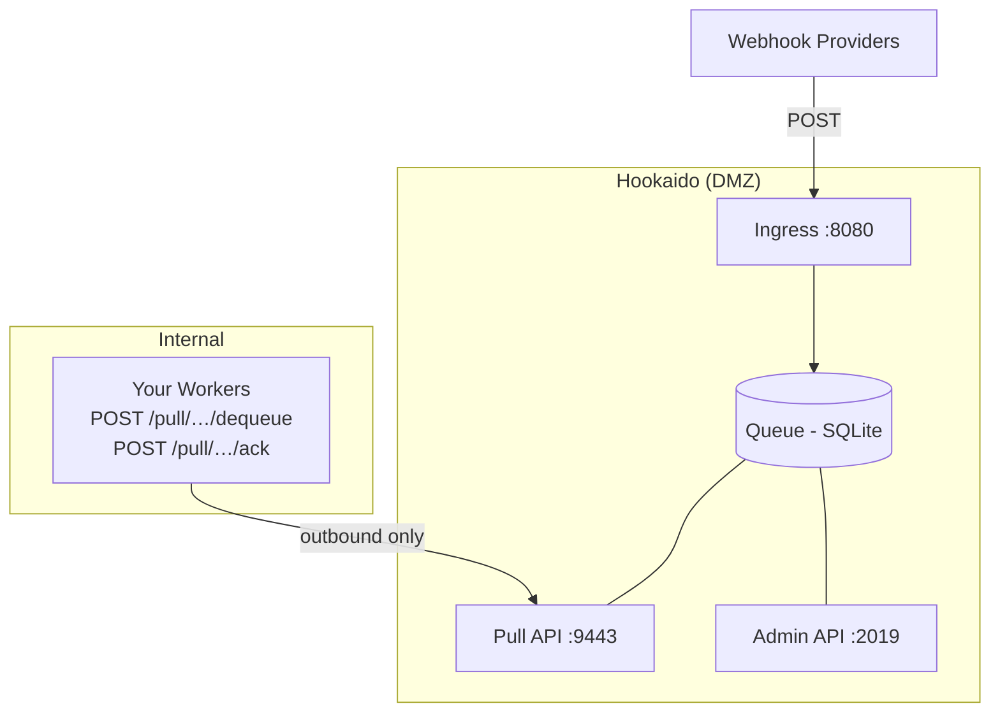
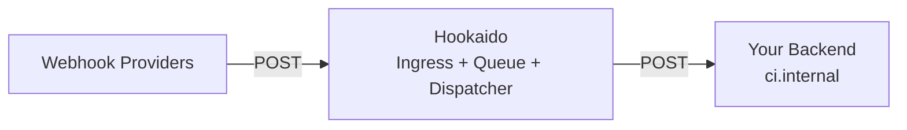

# Deployment Modes

Hookaido supports three deployment topologies. Choose based on your network security requirements and operational preferences.

## Pull Mode (Recommended Default)



**Key property:** Internal services only make outbound connections to the DMZ. No inbound access from DMZ to internal network is needed.

```hcl
pull_api {
  auth token env:HOOKAIDO_PULL_TOKEN
}

/webhooks/github {
  auth hmac env:HOOKAIDO_INGRESS_SECRET
  pull { path /pull/github }
}
```

This is the `dmz-queue pull` default: ingress + queue live in the DMZ, workers pull from inside.

## Push Mode



Hookaido delivers webhooks directly to your endpoints with configurable retry, backoff, and optional outbound signing.

```hcl
/webhooks/github {
  deliver "https://ci.internal/build" {
    retry exponential max 8 base 2s cap 2m jitter 0.2
    timeout 10s
  }
}
```

No Pull API is needed. This mode works well for `single-node` deployments where Hookaido runs alongside your application stack.

## Hybrid (Pull + Push)

You can mix pull and push routes in the same config — each route chooses its own mode:

```hcl
pull_api {
  auth token env:HOOKAIDO_PULL_TOKEN
}

# Pull mode: workers consume at their own pace
/webhooks/github {
  pull { path /pull/github }
}

# Push mode: deliver immediately with retry
/webhooks/stripe {
  deliver "https://billing.internal/stripe" {
    timeout 10s
  }
}
```

> A single route cannot use both `pull` and `deliver` — they are mutually exclusive per route.

## Outbound Channels

For API-to-queue-to-push flows where your application publishes events (via Admin API or MCP) and Hookaido delivers them — no ingress traffic is involved:

```hcl
outbound /notifications/slack {
  deliver "https://hooks.slack.com/services/..." {
    timeout 5s
    sign hmac env:SLACK_SIGNING_SECRET
  }
}
```

Messages are enqueued via `POST /messages/publish` or endpoint-scoped managed publish, then pushed by the dispatcher.

## Internal Job Queues

For internal job queues consumed by your workers via the Pull API — no ingress traffic and no push delivery:

```hcl
internal {
  /jobs/nightly-report {
    pull { path /pull/nightly }
  }
  /jobs/cleanup {
    pull { path /pull/cleanup }
  }
}
```

Messages are enqueued via `POST /messages/publish` and consumed by your workers over the Pull API.

> See [Channel Types](configuration.md#channel-types) for the full compile-constraint matrix.

## Shared Listener

If you want Pull API and Admin API on the same port, set both to the same listen address with distinct prefixes:

```hcl
pull_api {
  listen :9443
  prefix /pull
  auth token env:HOOKAIDO_PULL_TOKEN
}

admin_api {
  listen :9443
  prefix /admin
  auth token env:HOOKAIDO_ADMIN_TOKEN
}
```

Both prefixes must be set and non-overlapping (e.g., `/pull/*` vs `/admin/*`).

## Listener Summary

| Listener  | Default Address  | Purpose                                   |
| --------- | ---------------- | ----------------------------------------- |
| Ingress   | `:8080`          | Receives webhooks from external providers |
| Pull API  | `:9443`          | Workers dequeue/ack/nack/extend           |
| Admin API | `127.0.0.1:2019` | Health checks, DLQ, message management    |

All listeners support optional TLS and mTLS. See [Security](security.md) for TLS configuration.

## Queue Backend

Hookaido supports two queue backends:

| Backend            | Durability              | Use Case            |
| ------------------ | ----------------------- | ------------------- |
| `sqlite` (default) | Durable (WAL mode)      | Production          |
| `memory`           | In-process, non-durable | Development/testing |

```hcl
# Per-route (runtime uses one backend process-wide)
/webhooks/github {
  queue { backend sqlite }
  pull { path /pull/github }
}
```

> Mixed route backends (some `sqlite`, some `memory`) are rejected at config compile time. The `--db` path is ignored when `memory` is selected.

### Backups

Hookaido queue data is transient (queued → delivered/dead → pruned), so most deployments don't need scheduled backups. If you do want a snapshot:

```bash
# Online backup (safe while Hookaido is running, WAL-aware)
sqlite3 ./.data/hookaido.db '.backup backup.db'

# Or checkpoint WAL first, then copy
sqlite3 ./.data/hookaido.db 'PRAGMA wal_checkpoint(TRUNCATE);'
cp ./.data/hookaido.db backup.db
```

Filesystem snapshots (LVM, ZFS, EBS) also work — SQLite WAL is crash-safe.

> Hookaido does not include its own backup/export CLI. Standard SQLite tools are sufficient.

## Production Checklist

- [ ] Use `pull` mode for DMZ deployments (outbound-only from internal network)
- [ ] Set unique, strong `HOOKAIDO_PULL_TOKEN` values
- [ ] Enable TLS on Pull API and Admin API
- [ ] Use `sqlite` backend (default) with a persistent `--db` path
- [ ] Admin API defaults to localhost — expose only over a secure channel if needed
- [ ] Configure `queue_limits`, `queue_retention`, and `dlq_retention` for your throughput
- [ ] Enable [observability](observability.md) (metrics + access logs at minimum)

---

← [Documentation Index](index.md)
