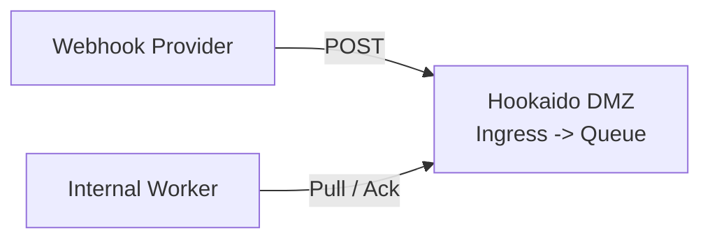

# Hookaido Documentation

  
Webhook ingress queue for DMZ-first systems

  <h2>Receive once. Process safely. Keep delivery under your control.</h2>
  

    Hookaido is a single binary that accepts webhooks at the edge, durably enqueues them,
    and lets internal workers consume at their own pace through pull or push flows.
  

  

    <a class="hk-button hk-button-primary" href="getting-started/">Start in 5 minutes</a>
    <a class="hk-button hk-button-secondary" href="configuration/">Read the DSL reference</a>
    <a class="hk-button hk-button-secondary" href="deployment-modes/">Choose deployment mode</a>
  

Use Ctrl + K to open search from any docs page.

## Choose Your Path

  

    <h3>Run Pull Mode</h3>
    
Use the DMZ default: ingress + queue in DMZ, internal workers dequeue and ack.

    
<a href="pull-api/">Pull API reference</a>

  

  

    <h3>Run Push Mode</h3>
    
Deliver to internal endpoints with retry, backoff, and optional outbound signing.

    
<a href="delivery/">Delivery reference</a>

  

  

    <h3>Operate the Queue</h3>
    
Inspect health, DLQ, and backlog trends from the Admin API.

    
<a href="admin-api/">Admin API reference</a>

  

  

    <h3>Integrate with MCP</h3>
    
Expose typed ops tools for AI agents with role-gated read and mutation controls.

    
<a href="mcp/">MCP integration</a>

  

## How It Works

1. A provider sends an HTTP request to Hookaido ingress.
2. Hookaido validates auth and routing rules, then durably enqueues before ACK.
3. Workers consume by Pull API or Hookaido delivers by push with retries.

## Core Guides

| Guide | Use it for |
| --- | --- |
| [Getting Started](getting-started.md) | First run, quick config, and local validation |
| [Configuration](configuration.md) | Full Hookaidofile blocks, defaults, and placeholders |
| [Deployment Modes](deployment-modes.md) | `dmz-queue pull`, push mode, and shared listener behavior |
| [Ingress](ingress.md) | Matching, auth, and rate limiting |
| [Pull API](pull-api.md) | Dequeue, ack, nack, extend contract |
| [Admin API](admin-api.md) | Health, backlog, DLQ, and message mutation endpoints |
| [Delivery](delivery.md) | Push retries, timeouts, concurrency, and signing |
| [Security](security.md) | Secret refs, TLS/mTLS, replay protection, SSRF policy |
| [Observability](observability.md) | Logs, metrics, tracing, and diagnostics |
| [Management Model](management-model.md) | Application and endpoint mapping semantics |
| [MCP Integration](mcp.md) | Tooling model, roles, and runtime controls |
| [Docs Platform Decision](documentation-platform.md) | Why docs currently stay on MkDocs Material |
| [OpenSSF Best Practices](ossf-best-practices.md) | Badge evidence links and maintenance checklist |

## Project Links

- [README.md](https://github.com/nuetzliches/hookaido/blob/main/README.md)
- [DESIGN.md](https://github.com/nuetzliches/hookaido/blob/main/DESIGN.md)
- [CHANGELOG.md](https://github.com/nuetzliches/hookaido/blob/main/CHANGELOG.md)
- [STATUS.md](https://github.com/nuetzliches/hookaido/blob/main/STATUS.md)
- [BACKLOG.md](https://github.com/nuetzliches/hookaido/blob/main/BACKLOG.md)
