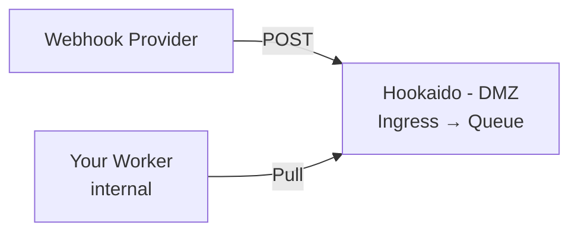

# Hookaido Documentation

Hookaido is a **webhook ingress queue** — a single binary that receives webhooks, durably enqueues them, and lets your internal services consume them at their own pace. Think of it as Caddy-style simplicity for webhook infrastructure.

## Key Properties

- **Single binary**, no runtime dependencies.
- **Config file is the source of truth** — compact Caddyfile-inspired DSL, hot-reloadable.
- **DMZ-first** — ingress + queue in the DMZ, internal workers pull via outbound-only connections.
- **At-least-once delivery** — ingress ACKs only after durable enqueue.
- **Pull or push** — pull mode (default) or push mode with retries, backoff, and outbound signing.
- **Channel types** — `inbound` (webhooks), `outbound` (API→queue→push), `internal` (job queues) with compile-time safety.

## How It Works

1. A webhook provider sends an HTTP POST to Hookaido's **ingress**.
2. Hookaido authenticates the request (HMAC, basic auth, or forward auth), then **durably enqueues** the payload.
3. Your internal worker **pulls** messages via the Pull API, processes them, and ACKs.

Alternatively, Hookaido can **push** (deliver) to your internal endpoints with configurable retry, backoff, and outbound HMAC signing.

## Documentation

| Guide                                   | Description                                                   |
| --------------------------------------- | ------------------------------------------------------------- |
| [Getting Started](getting-started.md)   | Install, configure, and run your first Hookaido instance      |
| [Configuration](configuration.md)       | Full DSL reference — all blocks, directives, and placeholders |
| [Deployment Modes](deployment-modes.md) | Pull vs push, DMZ topology, shared listeners                  |
| [Ingress](ingress.md)                   | Route matching, authentication, rate limiting                 |
| [Pull API](pull-api.md)                 | Dequeue, ACK, NACK, extend — the consumer protocol            |
| [Admin API](admin-api.md)               | Health checks, DLQ, message management, backlog insights      |
| [Delivery (Push)](delivery.md)          | Push dispatcher, retry policies, outbound signing             |
| [Security](security.md)                 | Secrets, TLS/mTLS, HMAC, SSRF protection                      |
| [Observability](observability.md)       | Logging, Prometheus metrics, OpenTelemetry tracing            |
| [Management Model](management-model.md) | Application/endpoint labels, publish policies                 |
| [Docker Quickstart](docker.md)          | Run Hookaido with Docker / Docker Compose                     |
| [MCP Integration](mcp.md)               | AI-assisted operations via Model Context Protocol             |
| [OpenSSF Best Practices](ossf-best-practices.md) | Badge evidence links and maintenance checklist         |

## Requirements

- Pre-built binaries available from [GitHub Releases](https://github.com/nuetzliches/hookaido/releases) (no Go needed)
- Build from source: Go 1.25+
- Official container image: `ghcr.io/nuetzliches/hookaido` (for example `docker pull ghcr.io/nuetzliches/hookaido:latest`)
- Docker: see [Docker Quickstart](docker.md)

## Project Links

- [DESIGN.md](https://github.com/nuetzliches/hookaido/blob/main/DESIGN.md) — canonical specification
- [CONTRIBUTING.md](https://github.com/nuetzliches/hookaido/blob/main/CONTRIBUTING.md) — contribution workflow
- [CODE_OF_CONDUCT.md](https://github.com/nuetzliches/hookaido/blob/main/CODE_OF_CONDUCT.md) — community standards
- [SECURITY.md](https://github.com/nuetzliches/hookaido/blob/main/SECURITY.md) — vulnerability reporting policy
- [GOVERNANCE.md](https://github.com/nuetzliches/hookaido/blob/main/GOVERNANCE.md) — maintainership and decisions
- [CHANGELOG.md](https://github.com/nuetzliches/hookaido/blob/main/CHANGELOG.md) — notable changes
- [STATUS.md](https://github.com/nuetzliches/hookaido/blob/main/STATUS.md) — development status
